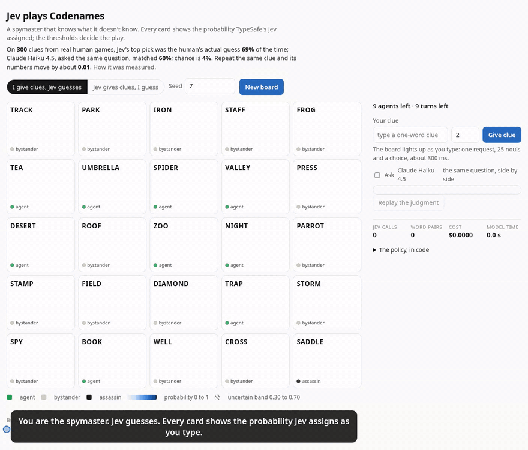

# codenames

A Codenames spymaster and guesser built on TypeSafe's Jev, through the direct API. The point is a public demo where each of Jev's properties is a visible game mechanic rather than a line in a README.

| Property | Where it shows |
| --- | --- |
| Fan-out | One request per clue carries 25 nouls and one choice. A spymaster turn judges every candidate clue against the whole board in seconds. |
| Calibration | The clue's number is the count of friendly words that clear the act threshold. The assassin has a hard ceiling. Words in the uncertain band are never counted. |
| Consistency | Same board, same clue, same numbers. Boards are seeded so any turn replays. |
| Code owns the workflow | Code deals the board, checks clue legality, sets every threshold, and picks the clue. Jev only answers "does this clue reach this word". |

Picking this up? Read [`HANDOFF.md`](HANDOFF.md) first: current state, what is unverified, and the steps left to finish the demo.

## The web app

```sh
export TYPESAFE_API_KEY=...
export ANTHROPIC_API_KEY=...   # optional; without it the clue proposer samples a fixed word list
bun run server/index.ts        # http://localhost:3000
```

One cooperative board: you and Jev against 9 agents, 15 bystanders, and 1 assassin, in 9 turns.

- **I give clues, Jev guesses.** Type a clue and the board lights up as you type: one request, 25 nouls and a choice, about 300 ms. The note under the input says what Jev would guess. "Replay the judgment" sends the same clue again and reports the largest change across the 25 words, which is how consistency is shown rather than claimed.
- **Side by side.** With an Anthropic key configured, a toggle asks a chat model (default Claude Haiku 4.5, `BASELINE_MODEL` to change it) the same question about the same clue in one structured call at temperature 0. Each card shows both numbers; a strip compares latency, cost, and how many words each model left in the uncertain band; replay reports both models' largest change. The comparison never drives play.
- **Jev gives clues, I guess.** Claude proposes candidate words from the key, code drops illegal ones, Jev judges every candidate against every word, code picks. Verdicts stream to the page as they land, with the reason for each rejection, and the pipeline strip sums the turn. Jev's probabilities stay hidden until your turn ends, then the board shows what it was thinking and which words it meant.
- **The header carries the evidence:** the phase 0 numbers from the eval below, served from `/api/config`.



A 48-second recording of both modes is in [`docs/codenames.mp4`](docs/codenames.mp4): a tempting clue that reaches the assassin, a clue whose number Jev refuses to over-guess, a replay showing the numbers hold, and Jev giving a clue of its own. It was captured with Playwright against the live API on seed 7 (`docs/record.mjs`), so anyone can replay the same board.

Environment: `PORT`, `CODENAMES_STYLE` (`full` or `compact` question wording), `JEV_MODEL`, `PROPOSER_MODEL` (default `claude-opus-5`), `TRUST_PROXY=1` to read `X-Forwarded-For` behind a reverse proxy. Games live in memory for two hours; per-IP token buckets limit previews, new boards, and Jev spymaster turns separately. Keys never reach the browser.

Routes, all JSON under `/api/games`: `POST /` (new game: `mode`, optional `seed`), `GET /:id`, `POST /:id/preview` (`clue`), `POST /:id/baseline` (`clue`; 404 when no comparison model is configured), `POST /:id/clue` (`clue`, `number`), `POST /:id/ask` (with `Accept: text/event-stream` it streams `start`, one `candidate` per verdict, then `done`), `POST /:id/guess` (`word`), `POST /:id/pass`. `GET /api/config` reports the models in use and the eval numbers.

## Layout

```
server/
  index.ts      Bun.serve: static page, JSON routes, rate limits, key handling
  session.ts    the game state machine, pure; both modes, views per role
web/
  index.html, styles.css, app.ts, card.ts   the page, light and dark, and the PNG turn card
src/
  board.ts      seeded deal: 9 / 8 / 7 / 1 (or 9 / 15 / 1 cooperative), mulberry32 so a seed reproduces a board
  legality.ts   one word, not on the board, not a compound, not an inflection
  questions.ts  the state and the 26 questions sent per clue
  judge.ts      TypeSafeJudge (live) and CachingJudge (replay from disk)
  scorer.ts     thresholds -> number, targets, risks, rejections; pickClue; guessOrder
  game.ts       spymasterTurn (propose -> legality -> judge -> pick, two rounds), applyGuesses, playGame
  proposer.ts   ClaudeProposer (structured output, candidates only), WordlistProposer, ListProposer
  baseline.ts   ClaudeBaseline: the same question to a chat model, one call, temperature 0; a Judge like any other
  cli.ts        `board <seed>`, `judge <clue> --seed <n>`, `play --seed <n> [--clues a,b,c]`
eval/
  dataset.ts    ClueRow, the JSONL row shape for human clue data
  salt.ts       converter for the SALT-NLP Codenames Duet data
  run.ts        the phase 0 gate: AUC, Brier, assassin, repeat std, latency, cost
  metrics.ts    pure metric functions
test/           unit tests for the engine and the session state machine; no network
data/           generated files, ignored by git (see data/README.md)
```

## The questions

State is small on purpose: a one-paragraph note on what a "connection" means in Codenames, the clue, and the unrevealed board words. Rules, arithmetic, and legality never go to the model.

Per clue, one request asks:

- **25 nouls**, one per word: would a typical guesser connect the clue to this word? The literal clue and word are in the instruction, and the criteria spell out what counts (meaning, category, common phrase, strong association) and what does not (a stretch, a pun, specialist knowledge). These are absolute, so a bad clue can score low everywhere.
- **1 choice** over the words: which word would a guesser pick first? This is relative and gives the guess order and a tie-break.

Both come from the docs' guidance to pair a choice (which one) with nouls (whether at all), and the jaggedness page's advice to reduce indirection and keep the state free of unrelated detail.

## The policy, in code

`DEFAULT_THRESHOLDS` in `src/types.ts` is the whole policy:

| Threshold | Default | Meaning |
| --- | --- | --- |
| `act` | 0.70 | A friendly word at or above this counts toward the clue's number and is guessed. |
| `uncertainLow` | 0.30 | Between here and `act` a word is uncertain: never counted, listed as a risk if it is not ours. |
| `assassinMax` | 0.10 | A clue with the assassin above this is rejected outright. |
| `opponentMax` | 0.40 | A clue with any opponent word above this is rejected. |

Among eligible clues, the score is the number, plus how far the targets clear `act`, minus half a point per risky non-friendly word. These defaults are a starting point; the eval below is what sets them.

## Phase 0: the gate

Before any UI, check that Jev's numbers track how people actually give and take clues. The data is the SALT-NLP Codenames Duet corpus (Shaikh et al. 2023): 7,703 human turns with the board, the clue, the giver's targets, the words they had to avoid, and the guess.

```sh
export TYPESAFE_API_KEY=...
git clone --depth 1 https://github.com/SALT-NLP/codenames /tmp/salt-codenames
bun run eval/salt.ts /tmp/salt-codenames data/salt-duet.jsonl
bun run eval/run.ts data/salt-duet.jsonl --n 100 --repeats 20 --repeat-rows 10
```

Pass criteria, set before the run: guess AUC and target AUC well above 0.5 (a random ranker scores 0.5), top-1 agreement with the human guess well above the 1-in-25 base rate, and a repeat std on the assassin small enough that `assassinMax` holds across repeats. Judgments cache in `data/cache-<model>-<style>.json`, so reruns with different thresholds are free; the stability repeats bypass the cache on purpose.

## Phase 0 results (2026-09-19, jev-1.13.0)

100 human clues sampled with seed 1, 20 repeats on 10 of them, both question wordings. The gate passed.

| metric | full wording | compact wording |
| --- | --- | --- |
| guess AUC (noul) | 0.941 | 0.940 |
| guess top-1, noul argmax | 0.64 | 0.64 |
| guess top-1, choice argmax | 0.63 | 0.63 |
| target AUC (noul) | 0.953 | 0.952 |
| Brier vs guessed | 0.069 | 0.079 |
| assassin noul mean / p90 | 0.215 / 0.420 | 0.244 / 0.430 |
| repeat std, all words | 0.012 | 0.015 |
| repeat std, assassin, mean / max | 0.011 / 0.018 | 0.012 / 0.021 |
| latency ms, median / p90 | 298 / 363 | 265 / 330 |
| input tokens per request | 3,247 | 1,537 |
| cost per request | $0.000136 | $0.000064 |

Reading it: a random ranker scores 0.5 AUC and 0.04 top-1, so Jev's per-word probability tracks both the giver's intent and the guesser's actual pick, and its single most likely word is the human's guess two times in three. Repeat std near 0.01 means a threshold decision moves only on words that sit within a hundredth of it. The assassin numbers describe the human clues, not Jev: Duet keys carry three assassins and human givers take real risks with them, so `assassinMax` at 0.10 would veto some clues people actually gave. That is the intended behavior for a spymaster that never loses on the assassin, and the eval is the place to tune it. `full` stays the default for its better calibration; `compact` is the flag to flip when cost or latency matters more.

## Trying it

```sh
bun run src/cli.ts board 7
bun run src/cli.ts judge river --seed 7
```
